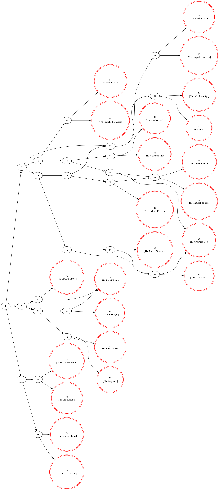

# Branching Realms - Data Validation & Backend Pipeline

## Overview
Branching Realms is a released, production-level mobile interactive fiction (CYOA) platform. This repository details the custom Python automation pipeline engineered to parse, validate, and analyze the application's complex non-linear data structures prior to database ingestion.

## Python Automation & Validation Scripts
Managing hundreds of interconnected data nodes required programmatic QA validation. I engineered two Python utility applications to automate the data pipeline:

1. **Relational Graph Mapper** (`LinearMaker.py`): A script that utilizes Regular Expressions and a Depth First Search (DFS) algorithm to crawl raw text documents. It maps the relational logic of user choices, identifies all possible linear paths through the data, and programmatically generates visual node flowcharts using the Graphviz library.
2. **Automated QA & NLP Analyzer** (`Story_Converter.py`): A data pipeline tool that converts raw text into structured JSON payloads. It utilizes the Natural Language Toolkit (NLTK) to analyze text complexity and automatically tag content. Crucially, the script executes automated QA validation to detect broken relational links, isolate "unreachable" data nodes, and verify data parity between the raw text and the generated JSON schema.

## Core Technologies
* **Languages:** Python
* **Libraries:** NLTK (Natural Language Toolkit), textstat, Graphviz, Tkinter
* **Methodology:** Depth First Search (DFS) algorithms, Automated QA validation, JSON data structuring

* ## Automated Output Example
Below is an example of a visual relational node graph generated entirely by the Python automation script from raw story text:

